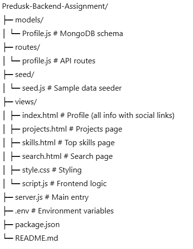
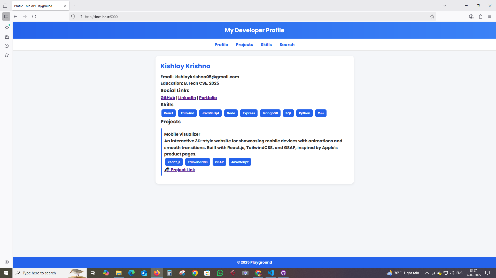
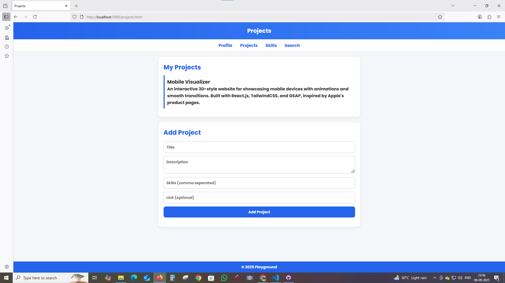
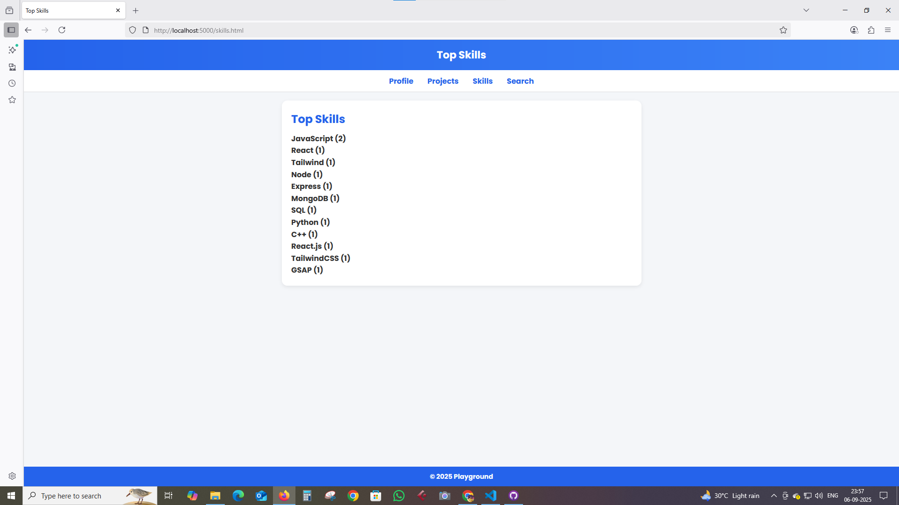
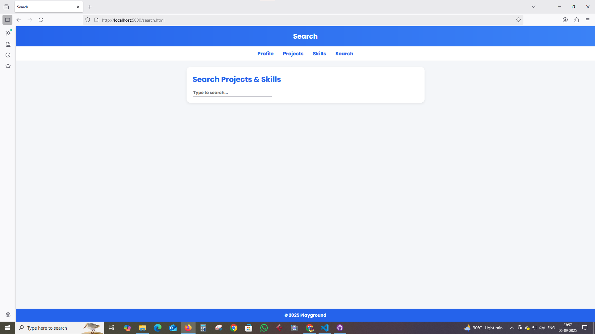

# Predusk-Backend-Assignment 🚀

A full-stack **Node.js + Express + MongoDB** application with a simple **frontend (HTML, CSS, JS)** that showcases profile details, projects, skills, and supports search functionality.  
The project also includes CRUD APIs with MongoDB Atlas integration.

---

## 📌 Features

- **Profile API** – Create, Read, Update developer profile (with social links)
- **Projects API** – Add, fetch, and search projects by skills
- **Skills API** – Get top skills (aggregated from profile & projects)
- **Search API** – Search across skills and projects
- **Health Check** – API health endpoint
- **Frontend Views** – Clean UI with navigation for Profile, Projects, Skills, and Search
- **Social Links** – GitHub, LinkedIn, Portfolio integrated into Profile

---

## 🛠️ Tech Stack

- **Backend:** Node.js, Express.js
- **Database:** MongoDB Atlas (Mongoose ORM)
- **Frontend:** HTML, CSS (custom styling), JavaScript
- **Other Tools:** Nodemon, Dotenv

---

## 📂 Project Structure



---

## ⚙️ Setup & Installation

1. **Clone Repository**
   ```bash
   git clone https://github.com/KrisJarvis/Predusk-Backend-Assignment.git
   cd Predusk-Backend-Assignment
   ```
2. **Install Dependencies**

   ```bash
   npm install

   ```

3. **Setup MongoDB Atlas**

   1.Create a cluster in MongoDB Atlas.
   2.Add a Database User and whitelist your IP (0.0.0.0/0 for dev).
   3.Get the Connection String.

4. **Create .env File**
   ```bash
   PORT=5000
   MONGO_URI=mongodb+srv://<username>:<password>@cluster0.abcde.mongodb.net/predusk_assignment?retryWrites=true&w=majority
   ```
5. **Run Dev Server**
   ```bash
   npm run dev
   ```
   
   
   
   
